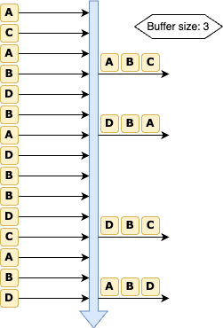

# Batchify

[](https://github.com/samber/go-batchify/releases)

[](https://pkg.go.dev/github.com/samber/go-batchify)

[](https://goreportcard.com/report/github.com/samber/go-batchify)
[](https://codecov.io/gh/samber/go-batchify)
[](https://github.com/samber/go-batchify/graphs/contributors)
[](./LICENSE)

Batchify will group and deduplicate concurrent tasks to reduce resource consumption.

Example:
- reduce in-flight requests to a database
- dedupe similar requests during a short period of time

This library is thread-safe.

<div align="center">
    
</div>

## 🚀 Install

```sh
go get github.com/samber/go-batchify
```

This library is v0 and follows SemVer strictly.

Some breaking changes might be made to exported APIs before v1.0.0.

## 🤠 Getting started

[GoDoc: https://godoc.org/github.com/samber/go-batchify](https://godoc.org/github.com/samber/go-batchify)

### Simple batch

```go
import "github.com/samber/go-batchify"

batch := batchify.NewBatch(
    10,
    func (ids []int) (map[int]string, error) {
        return ..., nil
    }
)

http.HandleFunc("/", func(w http.ResponseWriter, r *http.Request) {
    id, _ := strconv.Atoi(r.URL.Query().Get("id"))

    value, err := batch.Do(id)

    // ...
})
```

### Batch with periodic flush

```go
import "github.com/samber/go-batchify"

batch := batchify.NewBatchWithTimer(
    10,
    func (ids []int) (map[int]string, error) {
        return ..., nil
    },
    5*time.Millisecond,
)

http.HandleFunc("/", func(w http.ResponseWriter, r *http.Request) {
    id, _ := strconv.Atoi(r.URL.Query().Get("id"))

    value, err := batch.Do(id)

    // ...
})
```

### Sharded batches

```go
import "github.com/samber/go-batchify"

batch := batchify.NewShardedBatchWithTimer(
    5,                                           // 5 shards
    func(key int) uint64 { return uint64(key) }, // sharding key
    10,
    func (ids []int) (map[int]string, error) {
        return ..., nil
    },
    5*time.Millisecond,
)

http.HandleFunc("/", func(w http.ResponseWriter, r *http.Request) {
    id, _ := strconv.Atoi(r.URL.Query().Get("id"))

    value, err := batch.Do(id)

    // ...
})
```

### go-batchify + singleflight

```go
import (
    "golang.org/x/sync/singleflight"
    "github.com/samber/go-batchify"
)

var group singleflight.Group

batch := batchify.NewBatchWithTimer(
    10,
    func (ids []int) (map[int]string, error) {
        return ..., nil
    },
    5*time.Millisecond,
)

http.HandleFunc("/", func(w http.ResponseWriter, r *http.Request) {
    idStr := r.URL.Query().Get("id")
    id, _ := strconv.Atoi(idStr)

    value, err, _ = group.Do(idStr, func() (interface{}, error) {
        return batch.Do(id)
    })

    // ...
})
```

## 🤝 Contributing

- Ping me on Twitter [@samuelberthe](https://twitter.com/samuelberthe) (DMs, mentions, whatever :))
- Fork the [project](https://github.com/samber/go-batchify)
- Fix [open issues](https://github.com/samber/go-batchify/issues) or request new features

Don't hesitate ;)

```bash
# Install some dev dependencies
make tools

# Run tests
make test
# or
make watch-test
```

## 👤 Contributors


## 💫 Show your support

Give a ⭐️ if this project helped you!

[](https://github.com/sponsors/samber)

## 📝 License

Copyright © 2024 [Samuel Berthe](https://github.com/samber).

This project is [MIT](./LICENSE) licensed.
